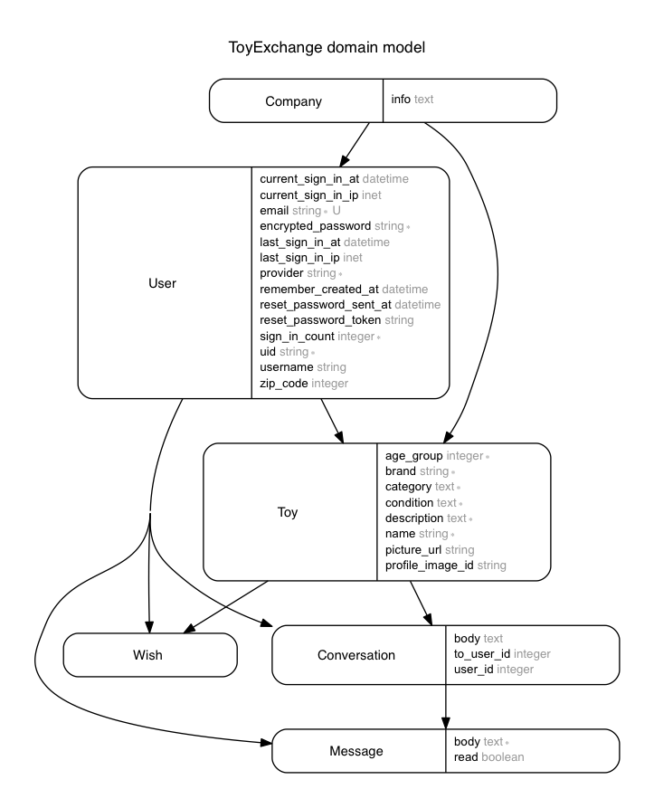

# ToyExchange

Welcome to Toy Exchange, a platform for parents to list toys they no longer need and find toys they want in their local community at no cost.
- _Toy Exchange_ is a website for parents who want to spend less on toys.
- Users can create an account, list the toys they no longer want and search for toys by category, brand, zip-code and age-group.
- When they find a toy they like, they can communicate with the Toy Exchanger and arrange for a pick-up.
- Check out the live site at [link](www.toyexchange.herokuapp.com)

# Libraries, software and other tools used
- Ruby(2.2.1)
- Rails(4.2.4)
- Bootstrap for styling and javascript
- Web hosting by Heroku
- Refile for image upload
- Refile Amazon S3
- Cucumber for model testing
- PostgreSQL Database
- Sass
- React for dynamic item search
- Bcrypt for password encryption
- Device
- Facebook API
- Mail_form
- Figaro

# Installation Steps
- Fork this Repo
- Clone this Repo
- Run bundle install
- Run rake db:create
- rails s to start server

# More information
- Current Trello scrum board [link](https://trello.com/b/a4rL0m36/toyexchange#)

